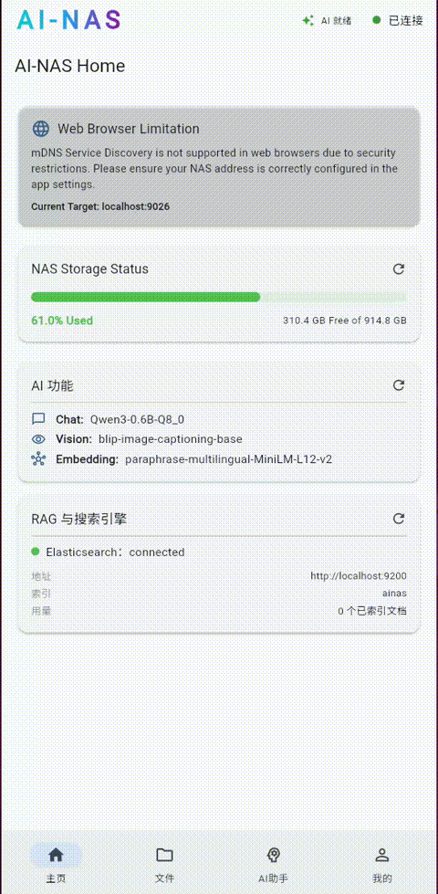
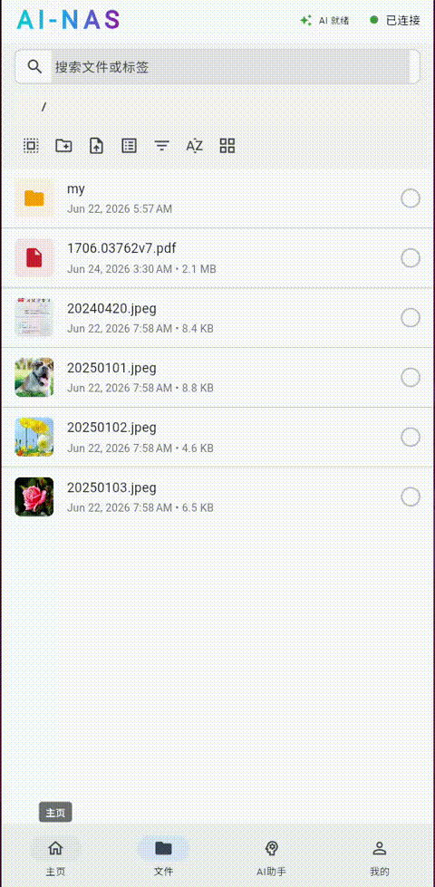

# AI-NAS: Intelligent Storage Management

[](https://github.com/zegang/ainas/releases)
[](https://github.com/zegang/ainas)
[](https://python.org)
[](https://flutter.dev)
[](https://dart.dev)
[](https://flutter.dev)
[](https://github.com/zegang/ainas/pulls)
[](https://zegang.github.io/ainas)

AI-NAS is a smart Network Attached Storage (NAS) management solution that integrates a powerful AI Assistant to simplify data management, system monitoring, and file operations through natural language.

## 🚀 Features

- **Conversational AI Assistant**: Manage your NAS using natural language commands.
- **Real-time Streaming**: Instant feedback for AI responses using server-sent events or streaming repositories.
- **Context-Aware File Operations**: Attach files directly from your NAS to the AI chat for analysis, summarization, or searching.
- **Quick Action Chips**: One-tap shortcuts for common tasks:
  - **Storage Health**: "How much storage is left?"
  - **Deep Search**: "Find all PDF files in /Home"
  - **System Optimization**: "Run a performance check"
- **Versatile AI Assistant**:
  - **Explain images**
  - **Lables on images**
  - ...
- **RAG with elasticsearch**: Exact retrieval and semantic similarity retrieval.
- **Cross-Platform GUI**: Responsive frontend built with Flutter.

## Demo Records

### Configurable Local AI Models: Easily download, configure and manage local AI models for your specific needs.


### Async AI Tags on Images: Automatically AI tags on image for easy search and organization.


### RAG PDF Embedding: Convert PDF documents to embeddings for retrieval-augmented generation.


### Split PDF Pages to Images: Convert every page of a PDF document to individual PNG images.


## Quantization Models

- Quant models with llama.cpp to run on resource constrained devices.


## 🏗️ Project Structure

- **`/frontend`**: The Flutter-based client application.
- **`/vendor`**: Custom Flutter toolchain and engine configurations.

## 🛠️ Tech Stack

- **Frontend**: Flutter / Dart
- **State Management**: standard `StatefulWidget` patterns (extensible to Riverpod/Bloc).
- **Communication**: REST API with real-time stream support.
- **Localization**: Official Flutter i18n support (ARB files).

## 🚦 Getting Started

### Local Development

1.  **Prerequisites**: Ensure you have the Flutter SDK installed.
2.  **Installation**:
    ```bash
    bash bootstrap.sh --setup
    ```
3.  **Run Backend**:
    ```bash
    bash bootstrap.sh --backend
    ```
4. **Run Frontend**:
    ```bash
    bash bootstrap.sh --frontend
    ```

### Docker (Recommended for Production)

Pre-built images are available on [GitHub Container Registry](https://github.com/anomalyco/ainas/pkgs/container/ainas-backend):

| Variant | Image |
|---------|-------|
| CPU     | `ghcr.io/anomalyco/ainas-backend:cpu` |
| NVIDIA GPU | `ghcr.io/anomalyco/ainas-backend:cuda` |
| AMD GPU | `ghcr.io/anomalyco/ainas-backend:rocm` |

Run the CPU variant:

```bash
docker run -d \
  --name ainas \
  -p 9026:9026 \
  -v ./storage:/app/storage \
  ghcr.io/anomalyco/ainas-backend:cpu
```

For NVIDIA GPU:

```bash
docker run -d \
  --name ainas \
  --gpus all \
  -p 9026:9026 \
  -v ./storage:/app/storage \
  ghcr.io/anomalyco/ainas-backend:cuda
```

For AMD GPU:

```bash
docker run -d \
  --name ainas \
  --device=/dev/kfd --device=/dev/dri \
  --group-add video \
  -p 9026:9026 \
  -v ./storage:/app/storage \
  ghcr.io/anomalyco/ainas-backend:rocm
```

The container serves both the backend API and the Flutter web frontend (at `http://localhost:9026`).

### Build Docker Image Locally

```bash
bash bootstrap.sh --build-backend-image cpu     # CPU (default)
bash bootstrap.sh --build-backend-image cuda    # NVIDIA GPU
bash bootstrap.sh --build-backend-image rocm    # AMD GPU
```